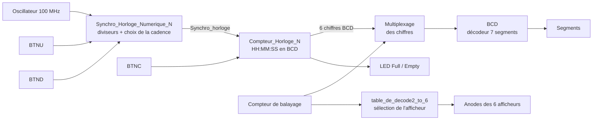

# Horloge numérique sur FPGA (VHDL, Nexys A7)

Horloge 24 heures affichant heures, minutes et secondes sur six afficheurs 7 segments d'une carte Nexys A7-100T, avec deux boutons d'avance rapide pour la mise à l'heure. Les blocs sont décrits en VHDL.

## Sommaire

1. [Présentation](#présentation)
2. [Matériel et outils](#matériel-et-outils)
3. [Architecture](#architecture)
4. [Détail des blocs](#détail-des-blocs)
5. [Brochage](#brochage)
6. [Contenu du dépôt](#contenu-du-dépôt)
7. [Limites et points à corriger](#limites-et-points-à-corriger)
8. [Compétences mises en œuvre](#compétences-mises-en-œuvre)

## Présentation

- **Cadre** : travaux pratiques d'électronique numérique, cycle ingénieur Instrumentation, Sup Galilée (Université Sorbonne Paris Nord), décembre 2023.
- **Objectif** : réaliser une horloge HH:MM:SS à partir de l'oscillateur 100 MHz de la carte, avec affichage multiplexé et mise à l'heure par avance rapide.
- **État** : blocs VHDL conservés ; le niveau supérieur du projet et les bancs de test n'ont pas été retrouvés (voir les limites).

## Matériel et outils

| Élément | Détail |
|---|---|
| Carte | Digilent Nexys A7-100T (FPGA Xilinx Artix-7) |
| Horloge | Oscillateur 100 MHz (broche E3) |
| Affichage | Afficheurs 7 segments de la carte, à anode commune, commandés à l'état bas |
| Entrées | Boutons BTNC (remise à zéro), BTNU (avance très rapide), BTND (avance rapide) |
| Sorties annexes | LED 5 (`Empty`) et LED 15 (`Full`) |
| Langage | VHDL |
| Outil | Xilinx Vivado (fichier de contraintes au format `.xdc`) |

## Architecture



Les blocs « Multiplexage des chiffres » et « Compteur de balayage » font partie du montage, mais leurs sources ne sont pas dans ce dépôt.

## Détail des blocs

### `Synchro_Horloge_Numerique_N` — base de temps

Trois compteurs divisent l'horloge de la carte pour produire trois cadences, puis un sélecteur choisit celle qui fait avancer l'horloge :

| Entrées | Cadence transmise | Usage |
|---|---|---|
| Aucun bouton | 1 Hz | Fonctionnement normal |
| `Avance_rapide_Slow` | Cadence intermédiaire | Mise à l'heure |
| `Avance_rapide_Fast` (prioritaire) | 1 kHz | Mise à l'heure rapide |

Chaque diviseur compte jusqu'à N, puis repart de zéro ; la sortie est à 1 pendant la première moitié du comptage, ce qui donne un rapport cyclique de 50 %. Avec une horloge de 100 MHz, N = 100 000 donne 1 kHz et N = 100 000 000 donne 1 Hz.

### `Compteur_Horloge_N` — comptage HH:MM:SS

Six compteurs en cascade, un par chiffre, sortis en BCD sur 4 bits :

| Signal | Chiffre | Plage |
|---|---|---|
| `BCD_U` | Unités des secondes | 0 à 9 |
| `BCD_D` | Dizaines des secondes | 0 à 5 |
| `BCD_M` | Unités des minutes | 0 à 9 |
| `BCD_T` | Dizaines des minutes | 0 à 5 |
| `BCD_DM` | Unités des heures | 0 à 9, limité à 3 quand les dizaines valent 2 |
| `BCD_CM` | Dizaines des heures | 0 à 2 |

- Remise à zéro asynchrone par `Reset` ou `INIT_CMPT`.
- Le passage de 23:59:59 à 00:00:00 est traité explicitement.
- Deux indicateurs : `Empty` (00:00:00) et `Full` (23:59:59).

### `table_de_decode2_to_6` — sélection de l'afficheur

Décodeur 3 bits vers 6 sorties actives à l'état bas : pour chaque valeur de `sel` (0 à 5), une seule anode est mise à 0 et les cinq autres restent à 1. C'est ce qui permet le multiplexage : un seul afficheur est allumé à la fois, et le balayage rapide donne l'impression d'un affichage permanent.

### `BCD` — décodeur 7 segments

Table de vérité codée avec `with ... select` : 4 bits en entrée, 7 segments en sortie, actifs à l'état bas (afficheurs à anode commune). Les valeurs 10 à 15 sont affichées en hexadécimal (A à F).

## Brochage

Extrait des lignes actives du fichier de contraintes :

| Port | Broche | Élément de la carte |
|---|---|---|
| `clk_brd[0]` | E3 | Oscillateur 100 MHz |
| `Reset` | N17 | Bouton central BTNC |
| `Avance_rapide_Fast` | M18 | Bouton haut BTNU |
| `Avance_rapide_Slow` | P18 | Bouton bas BTND |
| `seg[0]` à `seg[6]` | T10, R10, K16, K13, P15, T11, L18 | Segments a à g |
| `DP` | H15 | Point décimal |
| `afficheur_0` à `afficheur_5` | J17, J18, T9, J14, P14, T14 | Anodes des 6 afficheurs utilisés |
| `afficheur_6[0]`, `afficheur_7[0]` | K2, U13 | Anodes des 2 afficheurs inutilisés |
| `Empty` | V17 | LED 5 |
| `Full` | V11 | LED 15 |

## Contenu du dépôt

```
src/
├── Synchro_Horloge_Numerique_N.vhd   Diviseurs d'horloge et choix de la cadence
├── Compteur_Horloge_N.vhd            Compteur HH:MM:SS en BCD
├── table_de_decode2_to_6.vhd         Sélection de l'afficheur actif
└── BCD.vhd                           Décodeur BCD vers 7 segments
constraints/
└── nexys_a7_100t_horloge.xdc         Brochage (fichier maître Digilent, lignes utiles décommentées)
```

## Limites et points à corriger

- **Projet incomplet** : le niveau supérieur (probablement un schéma-bloc Vivado), le multiplexeur des chiffres, le compteur de balayage et les bancs de test n'ont pas été retrouvés. Le dépôt ne permet pas de régénérer le bitstream tel quel.
- **Cadence intermédiaire** : le commentaire annonce 10 Hz, mais le compteur s'arrête à 1 000 000 ; avec une horloge de 100 MHz, la sortie est à environ 100 Hz. Il faudrait compter jusqu'à 10 000 000.
- **Indicateur `Full`** : la condition teste dizaines d'heures = 3 et unités d'heures = 2, alors que 23 h correspond à dizaines = 2 et unités = 3. Tel quel, `Full` ne passe jamais à 1.
- **Entrée `Enable`** : déclarée dans le compteur mais non utilisée.
- **Horloge dérivée** : le compteur est cadencé par un signal issu d'un multiplexeur combinatoire. Une conception synchrone utiliserait l'horloge 100 MHz partout et un signal de validation (`clock enable`) pour éviter les aléas au changement de cadence.
- **Bibliothèques** : `STD_LOGIC_ARITH` et `STD_LOGIC_UNSIGNED` ne sont pas normalisées ; `NUMERIC_STD` est recommandée.
- **Vérification** : la synthèse et la simulation n'ont pas été rejouées lors de la rédaction de ce document.
- **Fichier de contraintes** : basé sur le fichier maître fourni par Digilent pour la Nexys A7-100T.

## Compétences mises en œuvre

- Description VHDL de logique séquentielle (compteurs, diviseurs d'horloge) et combinatoire (décodeurs).
- Comptage BCD en cascade avec gestion des retenues et du passage à minuit.
- Affichage 7 segments multiplexé.
- Affectation des broches par fichier de contraintes `.xdc`.

## Licence

Aucune licence n'a été définie pour ce code.
