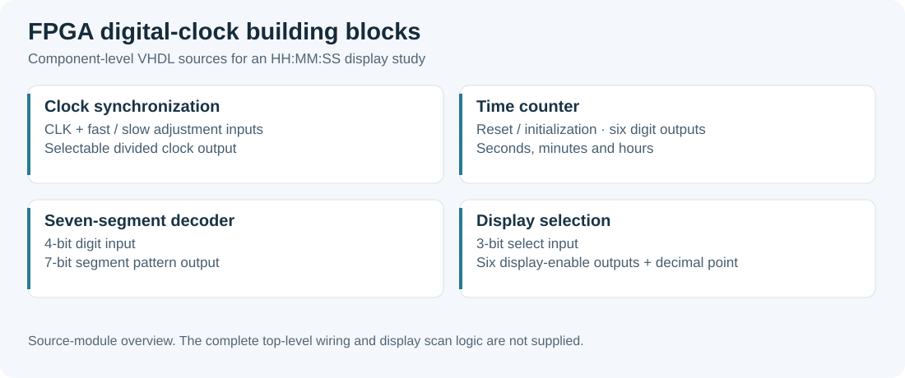

# FPGA Digital Design

VHDL laboratory material for a multiplexed digital clock, with original FPGA project archives.

*Technical study overview based on the available repository material.*

## Repository guide

- [Horloge_numerique_FPGA](Horloge_numerique_FPGA/): clock modules, display decoding and Nexys A7 constraints.
- [archive/ise_projects](archive/ise_projects/): historical Xilinx ISE work, preserved with its original internal layout.

The **FM tuning controller** now has its own canonical repository: [Minuterie_FPGA](https://github.com/tedjelmoulksn-dotcom/Minuterie_FPGA). Its maintained sources, diagrams and report are located there.

## Working with the clock

Read the module guide, inspect the VHDL sources and match the XDC constraints to your board. The clock study uses Vivado-style constraints; archived ISE projects belong to an older toolchain.

The available modules do not establish a newly validated complete board-level build. Check top-level integration, clocking and display timing before synthesis.
