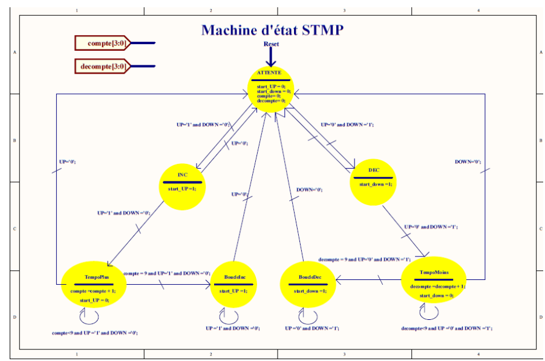

# FM Tuning Interface — VHDL State-Machine Exercise

Digital control for a displayed frequency from 87.5 to 108.0 MHz in 0.1 MHz steps. This is a tuner interface model, not an RF reception or demodulation implementation.

*Original state-machine design for increment, decrement and sustained button presses.*

## Control behaviour

Short presses request one increment or decrement. A held press enters a delay state and then repeated stepping. Both controls request initialisation in the associated coursework design.

[`src/FWSTMP.vhd`](src/FWSTMP.vhd) preserves the control state machine: idle, increment/decrement, delay and repeated-action states. Delay counting is expressed in clock cycles; its real duration depends on the input cadence.

## Related building blocks

BCD counting, initialisation and draft control sources are in [`src/tp2_tuner_fm/`](src/tp2_tuner_fm/). Multiplexed-display blocks are in [`src/tp1_affichage_multiplexe/`](src/tp1_affichage_multiplexe/).

The working report is in [`docs/`](docs/), with supporting captures in [`assets/`](assets/).

## Toolchain considerations

The original exercise used legacy Xilinx ISE/ISim and schematic-oriented design. The wider repository also includes Nexys A7/Artix-7 constraints, which require a compatible Vivado flow rather than assuming an ISE project can target that device directly.

Identify the actual target and reconstruct the top-level wiring before simulation or synthesis.

## Implementation review

The report/source archive includes inconsistent limit wiring: both boundary flags are connected to the lower-limit condition in one schematic. Divider values also differ from comments, and draft HDL files contain incomplete or invalid sections.

A testbench should check one-step behaviour at 87.5 and 108.0 MHz, simultaneous presses, reset and sustained stepping. Complete the top-level interconnections before synthesising the assembled interface.

## Validation and attribution

The report and source preserve the coursework's design progression, from button events to BCD output. Original attribution remains in place. No project-wide licence has been defined.

## Portfolio location

This folder is the main location for the FM tuning-interface project: VHDL sources, report and diagrams are collected here. The [Minuterie_FPGA repository](https://github.com/tedjelmoulksn-dotcom/Minuterie_FPGA) preserves an earlier supporting design archive of the same work. Treat these as two locations for one project.
