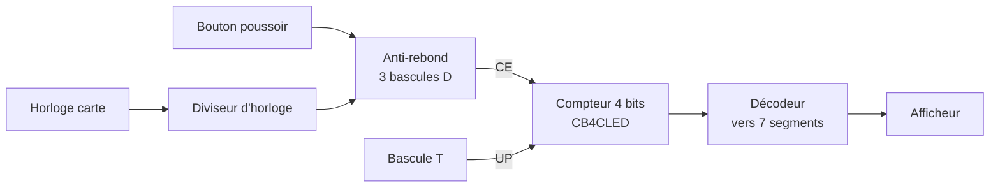
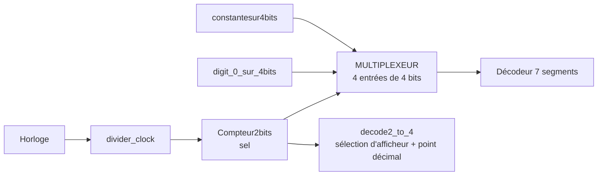
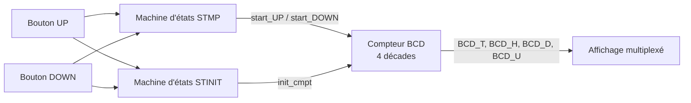

# Électronique numérique sur FPGA en VHDL — compteur et tuner FM

Travaux pratiques de conception numérique sur FPGA (Xilinx ISE, carte Nexys A7-100T) : prise en main avec un décodeur 7 segments et des bancs de test, compteur à bouton poussoir avec anti-rebond, affichage multiplexé sur quatre afficheurs, puis affichage de la fréquence d'un tuner FM piloté par deux boutons, avec appui court et appui long gérés par une machine d'états temporisée.


*Machine d'états principale (STMP) du tuner : attente, pas unitaire, temporisation, puis défilement continu.*

## Vue d'ensemble

- **Cadre** : TP d'électronique numérique, cycle ingénieur Instrumentation, Sup Galilée (Université Sorbonne Paris Nord), novembre–décembre 2023.
- **État** : travaux terminés, non maintenus. Le schéma de niveau supérieur du tuner n'est pas conservé (voir « Difficultés et limites »).

## Objectifs

Décrire des fonctions combinatoires et séquentielles en schéma et en VHDL, les simuler avec des bancs de test, puis les implémenter sur carte.

## Architecture du système

**Compteur à bouton poussoir (TP 0)**



**Affichage multiplexé (TP 1 « tuner 2.0 »)**



**Tuner FM (TP 2)**



## Matériel

| Élément | Détail |
|---|---|
| Carte | Digilent Nexys A7-100T (d'après le fichier de contraintes `nexys_a7_100t.ucf`) |
| Entrées | Boutons `SW_USER0`, `SW_USER1`, `TEST_BUTTON`, horloge `CLOCK_BRD` |
| Sorties | Afficheurs 7 segments (`AFFICHEUR0` à `AFFICHEUR7`, bus `seg`) |

## Logiciel

Xilinx ISE 14.7 : saisie de schéma, VHDL, simulateur ISim.

## Implémentation

| Bloc | Fichier | Rôle |
|---|---|---|
| Décodeur hexadécimal → 7 segments | `tp0_prise_en_main_ise/decodeur_hex_7segments.vhd` | 4 bits en entrée, 7 segments actifs à l'état bas, chiffres 0 à F |
| Anti-rebond | Schéma : 3 bascules D et une porte | La sortie ne change que si l'entrée reste stable pendant 3 fronts d'horloge |
| Compteur 4 bits | Symbole `CB4CLED` | Compte ou décompte selon `UP`, validé par `CE` |
| Compteur de sélection | `tp1_affichage_multiplexe/Compteur2bits.vhd` | Compteur 2 bits avec reset et validation `start_compteur` |
| Multiplexeur | `tp1_affichage_multiplexe/MULTIPLEXEUR.vhd` | Choisit une des 4 entrées de 4 bits selon `sel` |
| Sélection d'afficheur | `tp1_affichage_multiplexe/decode2_to_4.vhd` | Active un afficheur sur quatre (actif bas) ; point décimal `DP1` allumé quand `sel = "01"` |
| Chiffre de test | `tp1_affichage_multiplexe/digit_0_sur_4bits.vhd` | Compteur 0 → 9 cadencé par une horloge divisée (comparaison à 10 000 000) |
| Constante | `tp1_affichage_multiplexe/constantesur4bits.vhd` | Sortie fixe `"0001"` |
| Diviseur d'horloge | `tp1_affichage_multiplexe/divider_clock.sch` | Schéma ISE |
| Compteur BCD | `tp2_tuner_fm/compteur_BCD.vhd` | 4 décades de 0 à 9 ; `Reset` ou `INIT_CMPT` chargent 087,5 ; comptage bloqué à 108,0 (`IS_1080`) et décomptage bloqué à 087,5 (`IS_0875`) ; sorties `Full` et `Empty` |
| `STINIT` | `tp2_tuner_fm/FWSTINIT.vhd` | Machine d'états `attente` → `TempoPlus` → `RAZ` : si UP et DOWN restent appuyés pendant 9 incréments de la temporisation, `init_cmpt` passe à 1 |
| `STMP` | `FWSTMP.vhd` (version principale) et `tp2_tuner_fm/STMP_brouillon.vhd` (version de travail) | Appui court : un pas ; appui long : défilement |

Machine d'états `STMP` :

| État | Sorties | Transition |
|---|---|---|
| `attente` | `start_UP = 0`, `start_DOWN = 0`, temporisation remise à zéro | Vers `INC` si UP seul, vers `DEC` si DOWN seul |
| `INC` | `start_UP = 1` (un pas) | Vers `TempoPlus` si le bouton reste appuyé, sinon `attente` |
| `TempoPlus` | `compte = compte + 1` | Vers `BoucleInc` quand `compte = 9`, vers `attente` au relâchement |
| `BoucleInc` | `start_UP = 1` maintenu | Vers `attente` au relâchement |
| `DEC`, `TempoMoins`, `BoucleDec` | Symétriques | Symétriques |

Cahier des charges du tuner : plage 87,5 à 108 MHz par pas de 0,1 MHz sur 4 afficheurs ; appui court (< 2 s) = un pas ; appui long = défilement ; butées aux deux extrémités ; deux boutons pendant plus de 2 s = retour à 87,5 MHz.

## Principes d'ingénierie

- Logique synchrone : bascules D, compteurs, machines d'états finis.
- Multiplexage temporel des afficheurs : un compteur 2 bits pilote à la fois le multiplexeur de données et la sélection de l'afficheur.
- Compteur décimal en cascade avec butées haute et basse.
- Anti-rebond par échantillonnage.
- Séparation entre code de simulation (stimuli, `wait for`) et code synthétisable.

## Résultats

Le projet du TP 1 contient un bitstream généré (`schematuner.bit`, non repris dans le dépôt car c'est un fichier produit par l'outil), ce qui indique que la synthèse et le placement-routage ont abouti. Aucun chronogramme ni photo de la carte n'est conservé : **à documenter**.

## Difficultés et limites

- Les schémas de niveau supérieur (`schematuner.sch`, `etape2`, `etape3`) n'ont pas été retrouvés : le bitstream ne peut pas être régénéré avec les seuls fichiers présents.
- Dans `compteur_BCD.vhd`, les sorties `Full` et `Empty` sont toutes les deux reliées à `IS_0875` ; `Full` devrait vraisemblablement être reliée à `IS_1080` (à vérifier, fichier laissé tel quel).
- Dans `digit_0_sur_4bits.vhd`, le commentaire indique « divise par 100000000 » alors que la comparaison se fait à 10 000 000 ; le signal s'appelle `clock_1Hz` (fréquence réelle à vérifier selon l'horloge d'entrée).
- `STMP_brouillon.vhd` contient des erreurs de syntaxe (par exemple `else if UP<= '0';`) ; la version principale est `FWSTMP.vhd`.
- La synthèse et la simulation n'ont pas été rejouées lors de la rédaction.

## Structure du dépôt

```
src/FWSTMP.vhd                   Machine d'états principale du tuner
src/tp0_prise_en_main_ise/       Décodeur 7 segments, module Demo, bancs de test, schéma, contraintes
src/tp1_affichage_multiplexe/    Compteur 2 bits, multiplexeur, sélection d'afficheur, chiffre de test, diviseur
src/tp2_tuner_fm/                Compteur BCD, machine STINIT, brouillon de STMP
docs/                            Compte rendu des TP (à relire avant publication)
assets/                          Diagrammes, schéma et captures du code VHDL
```

## Exécution

Ouvrir un projet Xilinx ISE 14.7 ciblant la Nexys A7-100T, ajouter les sources de `src/`, puis lancer la simulation comportementale (ISim) sur un banc de test ou sur un bloc isolé.

## Médias


Algorigramme du compteur BCD : [`assets/algorigramme_compteur_bcd.jpg`](assets/algorigramme_compteur_bcd.jpg).

## Compétences démontrées

- VHDL combinatoire et séquentiel, multiplexage d'afficheurs, compteur BCD multi-décades, machines d'états temporisées.
- Écriture de bancs de test et simulation sous ISim.
- Flot Xilinx ISE complet jusqu'au bitstream : schéma, synthèse, contraintes de brochage.

## Licence

Aucune licence n'a été définie. Le fichier `.ucf` dérive du fichier maître fourni par Digilent.
